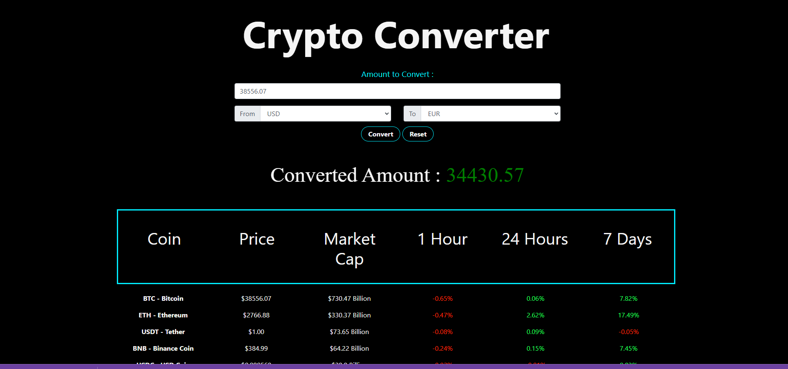

# Crypto-tracker

## Description:

This project is a crypto currency tracker that estimates the amount of crypto you can buy with whatever amount in USD/GBP/EUR invested.

## Table of Contens

- [Collaborators](#collaborators)
- [Technologies](#technologies)
- [Demo](#demo)
- [Usage](#usage)
- [License](#license)
- [Questions](#questions)

## Collaborators:

[Andy Waine](https://github.com/Andy-Waine)

[Bota Seri](https://github.com/Tari-Star)

[Casey Lister](https://github.com/caseylister)

[Miguel Puerto](https://github.com/M1guelp)

# Technologies

## Demo:

**_Deployed link:_** [https://tari-star.github.io/Crypto-tracker/](https://tari-star.github.io/Crypto-tracker/)

**_Repository link:_** [https://github.com/Tari-Star/Crypto-tracker](hhttps://github.com/Tari-Star/Crypto-tracker)

**_Screenshot:_**

# Usage
Simply enter desired amount in converter's input, choose currency and click convert. 

## License

**_This project is licensed under the [MIT license](https://choosealicense.com/licenses/mit)_**

---

## Questions?

  

For any questions about the repo, please contact us with the information below :

---

 ***To open an issue :***
 
 GitHub/Issues: [Crypto Tracker](https://Tari-Star/Crypto-tracker/issues)
